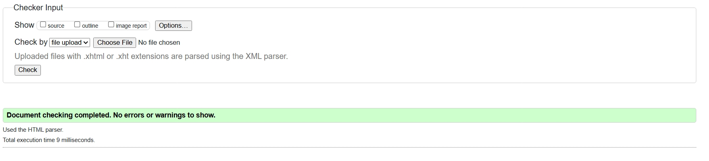

# PixelPulse Agency – One-Page Professional Website

This is a complete HTML5-only one-page website for a creative digital agency.  
It demonstrates full mastery of semantic HTML5, accessibility, internationalization, advanced forms, and media embedding.

## ✅ Validation
- W3C Validator: **0 errors, 0 warnings**
- Accessibility Check (WAVE/axe): **0 errors**

## 📁 Project Structure
pixelpulse-agency/ ├── index.html ├── README.md └── assets/ ├── Image.jpg ├── audio.mp3 └── video.mp4

## 🌍 Internationalization
- Arabic + English content
- `dir="rtl"` and `<bdi>` for mixed names
- `<wbr>` for long URLs

## ♿ Accessibility
- Semantic landmarks (`<header>`, `<nav>`, `<main>`, `<footer>`)
- Alt text for images
- Proper heading hierarchy

## 🧪 HTML5 Concepts Used
- `<main>`: wraps primary content
- `<article>`: portfolio & testimonials
- `<aside>`: announcement
- `
/
`: Easter egg
- `<mark>`: highlight
- `<time>`: footer date
- `<bdi>`: mixed names
- `<wbr>`: long URLs
- `<pre><code>`: snippet in footer
- `<output>`, `<meter>`, `<progress>`: form indicators

## 👩‍💻 Author
**Norhan Ayman**  
Faculty of Computers and Information – Mansoura University
